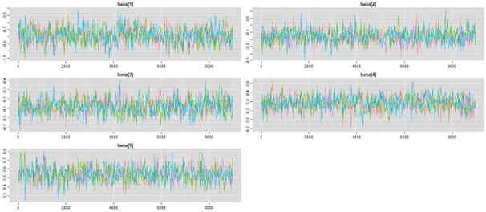

# Deprivation gradient and child abuse and neglect in Los Angeles County
---

This repository contains the code and models used in the analysis presented in: Barboza-Salerno, G. E. (2023). *The neighborhood deprivation gradient and child physical abuse and neglect: A Bayesian spatial model.* Child Abuse & Neglect, 146, 106501. https://doi.org/10.1016/j.chiabu.2023.106501.

## Data Sources

- **Area Deprivation Index (ADI):** Tract-level deprivation indicators downloaded via `sociome::get_adi()` for 2010
- **Census Tracts:** 2010 TIGER/Line shapefiles for Bernalillo County from the `tigris` package
- **Child Maltreatment Data:** Observed and expected counts of child physical abuse and neglect (can be downloaded [here](https://chi-phi-nmcdc.opendata.arcgis.com/))

---

## Workflow Summary

1. **Setup and Preprocessing**
 - Disable scientific notation
 - Set working directory and point to WinBUGS
 - Download ADI and generate quintiles
 - Summarize deprivation statistics

2. **Spatial Geometry**
 - Load and order 2010 census tracts
 - Create spatial weights matrix for CAR model using `spdep`

3. **Data Preparation**
 - Load observed and expected abuse/neglect counts
 - Attach ADI deprivation values
 - Format all matrices and vectors for WinBUGS input

4. **Bayesian Spatial Model**
 - Model structure includes:
   - Poisson likelihood
   - CAR spatial random effect
   - Gaussian heterogeneity term
   - Fixed effect for ADI
 - Run using `pbugs` and WinBUGS interface

5. **Post-Estimation and Inference**
 - Extract posterior summaries (mean, SD, quantiles)
 - Compute relative risk by ADI quintiles
 - Evaluate variance components for spatial and unstructured effects

---

## Example Output

- Posterior estimates of relative risk (RR) for child physical abuse by deprivation quintile
- Posterior summaries for:
- `beta`: fixed effect of deprivation
- `sd.sp`: standard deviation of spatial random effects
- `sd.h`: standard deviation of unstructured heterogeneity
- DIC computation using custom `DICPoisson()` function

---

## Model Specifications

The model is specified in R as a function (`RegEcoLinear`) and follows the formulation provided by:

**Martinez-Benito & Botella-Rocamora (2018)**  
*Disease Mapping: From Foundations to Multidimensional Modeling*  
(See book for detailed model construction)

Key components:

- `O[i] ~ Poisson(lambda[i])`
- `log(lambda[i]) = log(E[i]) + log.theta[i]`
- `log.theta[i] = mu + beta * deprivation[i] + sd.sp * sp[i] + sd.h * het[i]`
- `sp[i]` ~ CAR.normal structure
- `het[i]` ~ N(0, 1)

---

## Reproducibility Notes

- Observed and expected count data files must be named `obs.csv` and `exp.csv`
- Replace file paths with your local directory structure
- Ensure `GEOID` codes align across shapefiles and data matrices
- WinBUGS must be fully installed and unblocked by your security settings

---

## Citation

If using this code or adapting it for your own research, please cite:

> Barboza-Salerno, G. E. (2023). *The neighborhood deprivation gradient and child physical abuse and neglect: A Bayesian spatial model.* Child Abuse & Neglect, 146, 106501. https://doi.org/10.1016/j.chiabu.2023.106501

---

## License

This code is made available for non-commercial research and educational use only. For other uses or questions, please contact the author.
